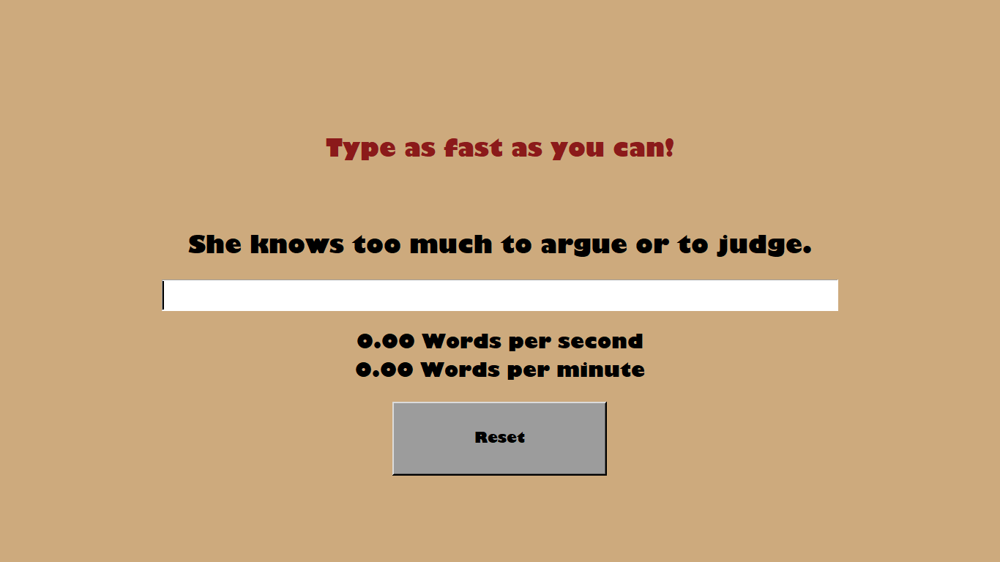
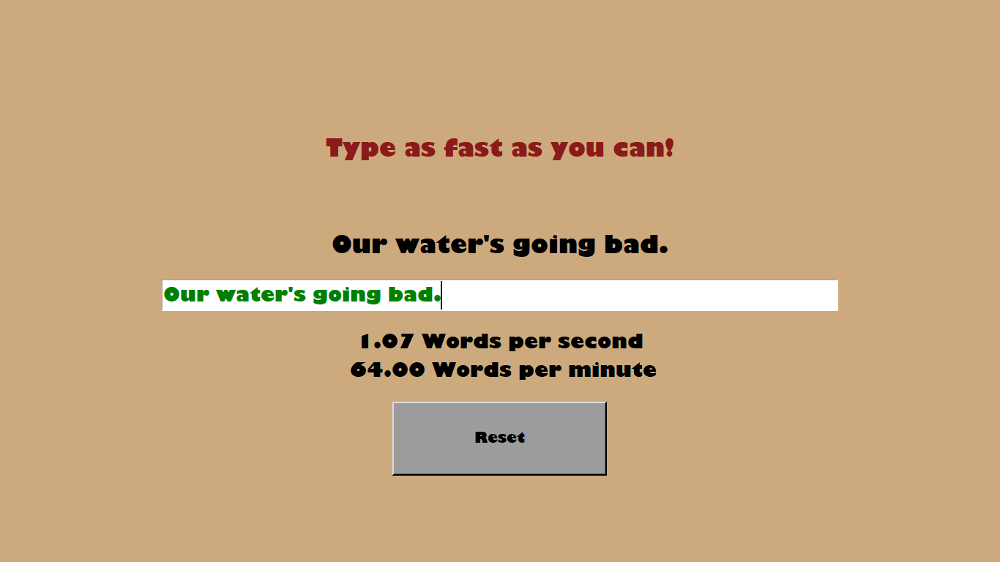
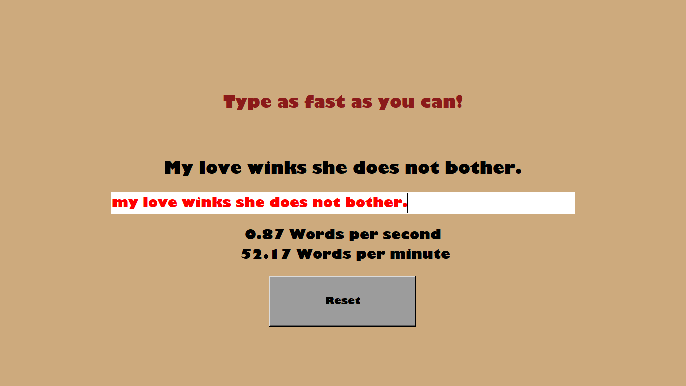

# **Speed Typing with Phrases**

With this script you will be able to play or train your typing technique. Instead of words you will type whole sentences

*This is a simple script for run speed typing with phrases*

## **How to play:**

You must type the **exact** same phrase that appears on the screen, including upper and lower case letters, dots and apostrophes.

After the whole sentence had been typed and pressing **enter** the counter will show your score.

If your phrase is incorrect or incomplete, you will not be able to press enter. The text will indicate the colors ***red for incorrect*** and ***black for incomplete.***

#### *Examples*

*This is how program will look*
{width=683px}

*This happens when you type the exactly same phrase*

*This happens when you do not type the exactly same phrase*
